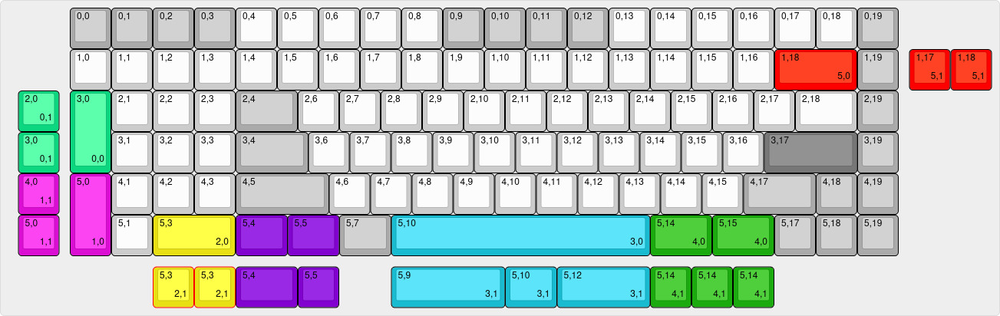
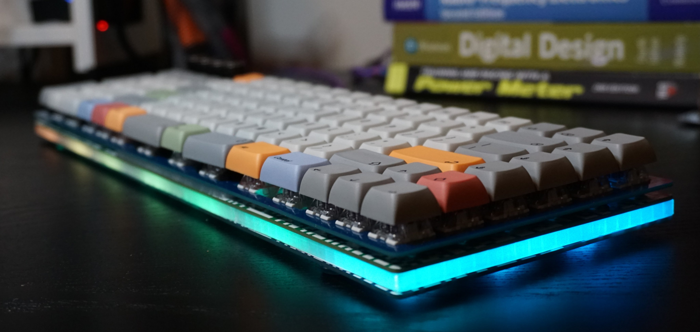

# Entropy

## A 96% Southpaw keyboard, with split space and encoder support. 

Entropy started as a STM32 powered keyboard running QMK and enclosed in a FR4 and PLA case, but at the time of writing runs on a nRF52 and ZMK, tucked inside a stacked acrylic case.

ZMK enables wireless functionality, and you'll get upwards of 6 months battery life thanks to the 200uA sleep current.

It also supports up to 4 rotary incoders in 5 different positions, along with a myriad of layout options.

## Photos
TODO

## Layout
Supports Encoders in (0,0)...(0,3) and (0,19)

ZMK versions only allow 4 encoders to be populated (hiting interrupt limit with 5 encoders)

## Revision History

R0.1: 
- Original STM32 design, no bugs that can't be worked around. 
- Tested and working.

R0.2: 
- Removed overengineering, modified to suit JLCSMT. 
- Fixed plate 2U tight fit. 
- **Has known issues with powering the LEDs, do not use**

### Image of R0.1 and R0.2 Design

R0.3: 

- Moved to nRF52840 and ZMK due to supply issues with the STM32F303 used in R0.1 and R0.2.
- Case design changed to plate mount in stacked acrylic case.
- Design moved to KiCad V6.

R0.4: 
- Battery life and design improvements over R0.3. 
- Few issues requiring rework but suitable for use.

R0.5: 
- Resolved issues found in R0.4, however untested. 
- **Use at your own risk.**