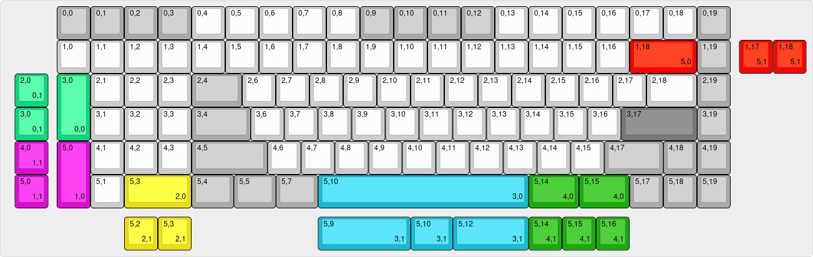

# Entropy

## A 96% Southpaw keyboard, with split space and encoder support. 

R0.1: Original design, no bugs that can't be worked around. Tested and working.

R0.2: Removed overengineering, modified to suit JLCSMT. Fixed plate 2U tight fit. Untested.

## Features:
- Encoder support in 0,0 -> 0,3 + 0,19
- STM32F303 MCU with QMK and VIA Support (not upstream)

Supported Keymaps

